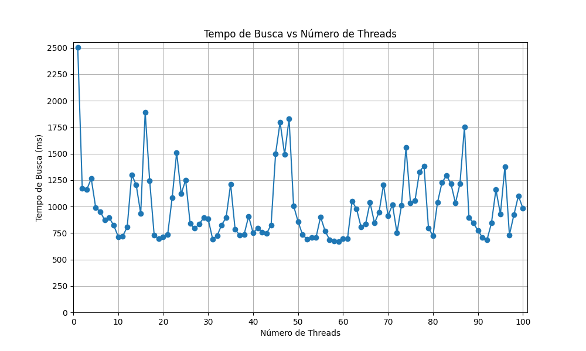

# Exercício de paralelismo através de threads

### Computação Escalável

> ## Grupo
> 
> - Dominique de Vargas de Azevedo
> - Pedro Thomaz Conzatti Martins
> - Tatiana Lage
> - Thiago Franke Melchiors

## Instruções

1. Execute `increaseVolume.py` em um compilador de **python** para aumentar 300 vezes o volume de dados original de `shakespeare.txt`.

2. Execute `wordCounter.cpp` em um compilador de **C++** para realizar a contagem de palavras na obra de Shakespeare. Por padrão, as palavras são *love* e *hate*.

3. Execute `graphMaker.py` em um compilador de **python** com o conjunto de dados gerador em `2`.

     - São necessárias as bibliotecas pandas e matplotlib.pyplot.

## Visualização

O gráfico abaixo representa o resultado que obtivemos com o nosso algoritmo de processamento em paralelo utilizando threads:

